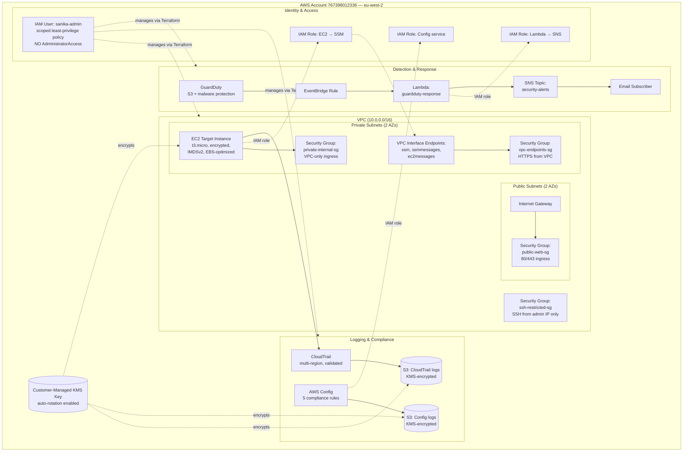

# Architecture Diagram

## Component Summary

| Layer | Components |
|---|---|
| **Network** | VPC, 2 public + 2 private subnets across 2 AZs, IGW, route tables, 3 security groups, 3 VPC interface endpoints |
| **Compute** | EC2 target instance (private subnet, encrypted, IMDSv2 enforced, EBS-optimized, detailed monitoring) |
| **Logging** | Multi-region CloudTrail, AWS Config with 5 compliance rules, both writing to KMS-encrypted S3 |
| **Detection** | GuardDuty (S3 + malware protection), 400 sample findings mapped to 8 MITRE ATT&CK tactics |
| **Response** | EventBridge → Lambda → SNS, validated end-to-end via direct invocation |
| **Encryption** | Customer-managed KMS key with automatic rotation, applied to all S3 buckets, DynamoDB, and EBS |
| **IAM** | Least-privilege policy (no AdministratorAccess), scoped IAM roles per service (SSM, Config, Lambda) |
